# Morpho Blue Bundlers

[Morpho Blue](https://github.com/morpho-org/morpho-blue) is a new lending primitive that offers better rates, high capital efficiency and extended flexibility to lenders & borrowers. `morpho-blue-bundlers` hosts the logic that builds alongside the core protocol like MetaMorpho and bundlers.

## Structure

```mermaid
graph
subgraph " "
    TransferBundler
    WNativeBundler
    Permit2Bundler
    ERC20WrapperBundler
    ERC4626Bundler
    MorphoBundler
    PermitBundler
    UrdBundler
    StEthBundler
end
subgraph "Migration Bundlers"
    MigrationBundler
    CompoundV3MigrationBundler
    CompoundV2MigrationBundler
    AaveV3MigrationBundler
    AaveV3OptimizerMigrationBundler
    AaveV2MigrationBundler
end
subgraph "General Bundlers"
    EthereumPermitBundler
    EthereumStEthBundler
    EthereumBundler
end
BaseBundler --> TransferBundler
BaseBundler --> WNativeBundler
BaseBundler --> Permit2Bundler
BaseBundler --> ERC20WrapperBundler
BaseBundler --> ERC4626Bundler
BaseBundler --> MorphoBundler
BaseBundler --> PermitBundler
BaseBundler --> UrdBundler
BaseBundler --> StEthBundler
TransferBundler --> MigrationBundler
Permit2Bundler --> MigrationBundler
ERC4626Bundler --> MigrationBundler
MorphoBundler --> MigrationBundler
PermitBundler --> MigrationBundler
MigrationBundler --> CompoundV3MigrationBundler
WNativeBundler --> CompoundV2MigrationBundler
MigrationBundler --> CompoundV2MigrationBundler
MigrationBundler --> AaveV3MigrationBundler
MigrationBundler --> AaveV3OptimizerMigrationBundler
MigrationBundler --> AaveV2MigrationBundler
StEthBundler --> AaveV2MigrationBundler
PermitBundler --> EthereumPermitBundler
StEthBundler --> EthereumStEthBundler
TransferBundler --> EthereumBundler
WNativeBundler --> EthereumBundler
Permit2Bundler --> EthereumBundler
ERC20WrapperBundler --> EthereumBundler
ERC4626Bundler --> EthereumBundler
MorphoBundler --> EthereumBundler
UrdBundler --> EthereumBundler
EthereumPermitBundler --> EthereumBundler
EthereumStEthBundler --> EthereumBundler
```

Each Bundler is a domain-specific abstract layer of contract that implements some functions that can be bundled in a single call by EOAs to a single contract. They all inherit from [`BaseBundler`](./src/BaseBundler.sol) that enables bundling multiple function calls into a single `multicall(bytes[] calldata data)` call to the end bundler contract. Each chain-specific bundler is available under their chain-specific folder (e.g. [`ethereum`](./src/ethereum/)).

Some chain-specific domains are also scoped to the chain-specific folder, because they are not expected to be used on any other chain (e.g. DAI and its specific `permit` function is only available on Ethereum - see [`EthereumPermitBundler`](./src/ethereum/EthereumPermitBundler.sol)).

User-end bundlers are provided in each chain-specific folder, instanciating all the intermediary domain-specific bundlers and associated parameters (such as chain-specific protocol addresses, e.g. [`EthereumBundlerV2`](./src/ethereum/EthereumBundlerV2.sol)).

## Getting Started

Install dependencies with `yarn`.

## Audits

All audits are stored in the [audits](./audits/)' folder.

## License

Bundlers are licensed under `GPL-2.0-or-later`, see [`LICENSE`](./LICENSE).
